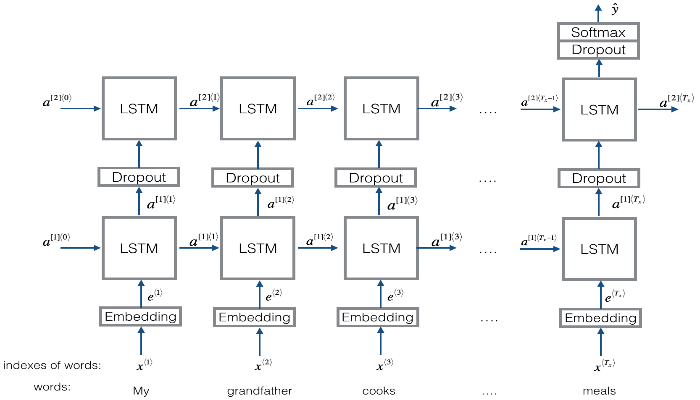
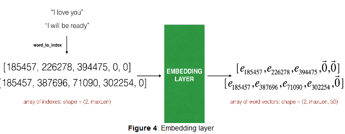

# Emoji-Prediction-Sentiment-Analysis-

This is a simple task of building an LSTM model that takes in input a sentence and predicts the most appropriate emoji for that sentence. For this task we use the pretrained Glove vector embeddings that are 50 dimensional. 

## Dataset Used
We have a tiny dataset (X, Y) where:
- X contains 127 sentences (strings).
- Y contains an integer label between 0 and 4 corresponding to an emoji for each sentence.

## Overview of the model

We build a keras model using lstm . The basic architecture of the model is shown in the below image

### Keras and mini-batching 

* We will train Keras using mini-batches.

#### Reason for Padding

* However, most deep learning frameworks require that all sequences in the same mini-batch have the **same length**. 
    * This is what allows vectorization to work: If you had a 3-word sentence and a 4-word sentence, then the computations needed for them are different (one takes 3 steps of an LSTM, one takes 4 steps) so it's just not possible to do them both at the same time.
    
#### Padding handles sequences of varying length
* The common solution to handling sequences of **different length** is to use padding.  Specifically:
    * Set a maximum sequence length
    * Pad all sequences to have the same length. 
    
##### Example of padding
* Thus, the sentence "I love you" would be represented as . 
* In this example, any sentences longer than 20 words would have to be truncated. 

## Embedding Layer
* We build an embedding layer in Keras :-  [Embedding()](https://keras.io/layers/embeddings/)
* We will initialize the embedding layer with 50 dimensional Glove Word Vectors
* Input of the embedding layer is a matrix of dimension (batch_size , max input length) while output is an array of shape
(batch_size , max input len , dimension of word vectors).

